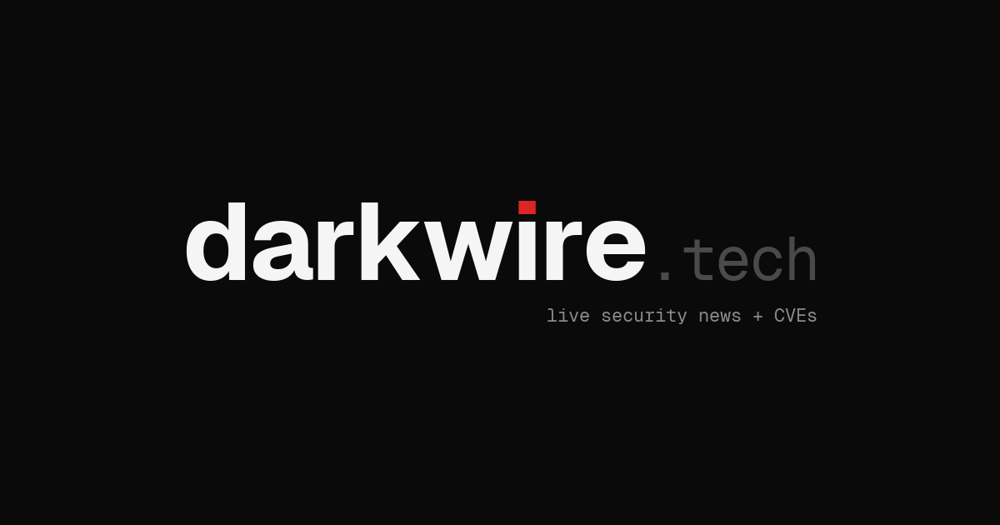
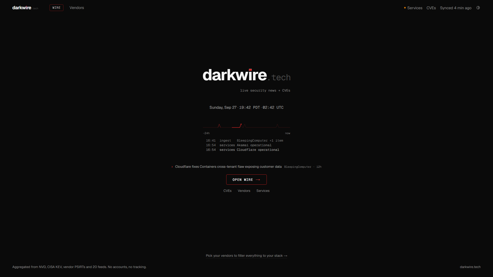
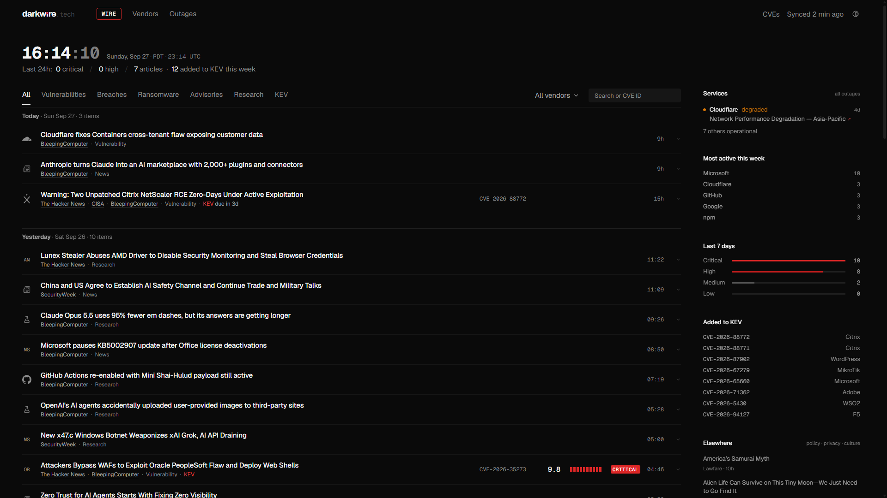
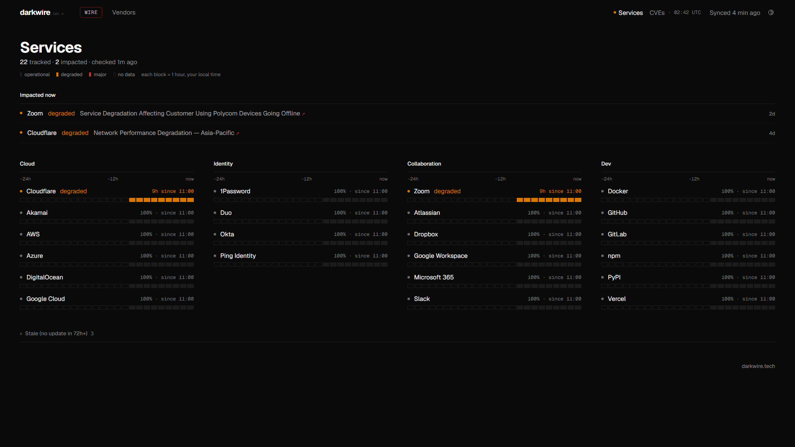
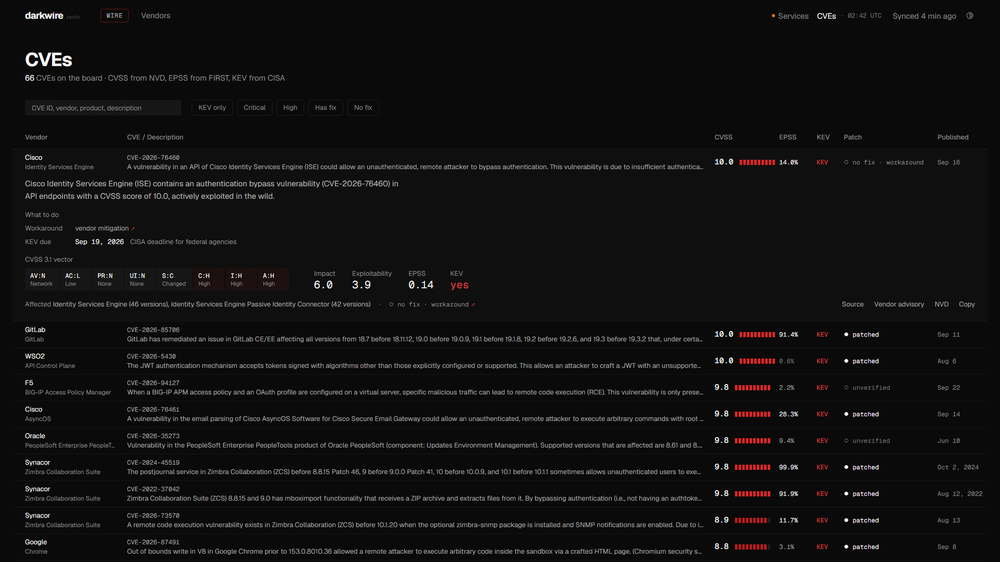

<p align="center"></p>

Security news and CVEs on one live board. No accounts. No ads. No tracking.

**https://darkwire.tech**





| Services | CVEs, one row expanded |
|---|---|
|  |  |

## What it is

- **One merged feed.** Security news from ten feeds (news outlets, CISA and a vendor PSIRT), clustered so one story is one row, whoever covered it.
- **Vendor tagging.** Rows are tagged to one of 56 vendors by alias match on the headline, so the board can be filtered to a vendor.
- **CVSS, EPSS and KEV.** CVE rows carry the NVD score, vector and affected versions, the FIRST EPSS probability, and CISA KEV status with its due date.
- **Patch status.** "Patched" only when NVD or the vendor names a fix and no coverage says otherwise; "no fix" when coverage says unpatched; otherwise unverified.
- **Services.** About 20 third-party services (cloud, identity, collaboration, dev) from their official status pages: a 24-hour strip each and the last 7 days of incidents.
- **Your stack.** Pick vendors with `?stack=` and the board filters to them. The URL is the setting, so it can be shared as-is.

## How it works

- **Sources and ingest.** The API reads RSS and Atom feeds every 15 minutes. Ads and sponsored posts are skipped, and so is anything dated in the future. The full list is in [`api/app/seed.py`](api/app/seed.py).
- **Dedupe.** Articles cluster by a shared CVE ID first; otherwise by title similarity, a shared product and "zero-day", or shared distinctive words, within 48 hours. Each article attaches only the CVE IDs tied to its headline, not every ID in a bulletin it lists.
- **Enrichment.** NVD for the CVSS vector, scores, affected CPE ranges and reference tags. The CISA KEV catalog for known exploitation, polled hourly. FIRST for EPSS. All cached in Postgres.
- **Summaries.** Each row gets a two-sentence summary from `claude-haiku-4-5`, generated once and cached. The model gets only the article text: no tools, no NVD or vendor data. Output is plain text and is validated before it is stored: length limits, no URLs or markdown, and no claim of a fix unless vendor data already says patched. Without an API key the board runs without summaries.
- **Live updates.** Open pages poll every minute and insert new rows at the top. A hidden tab shows the count of unseen rows in its title and a dot on the favicon.

## Privacy

No accounts, no cookies, no analytics, no tracking scripts. The optional "remember on this browser" setting stores only your stack and theme, locally in `localStorage`. Nothing about visitors is sent anywhere.

## Security

- Content-Security-Policy with a per-request nonce, HSTS, `X-Frame-Options: DENY`, a strict referrer policy and a restrictive Permissions-Policy on the web app.
- Per-IP rate limits on the API; CORS limited to GET from the site; no public API docs in production.

To report a vulnerability, see [SECURITY.md](SECURITY.md).

## Stack

- `web/`: Next.js (App Router, TypeScript, Tailwind) on Vercel.
- `api/`: FastAPI, SQLAlchemy and Alembic on PostgreSQL, with APScheduler for ingest and enrichment, on Railway.

## How this was built

darkwire was built by one security practitioner with Claude Code as the coding partner. The human set the goals, rules and design and reviewed the work. The working rules in [CLAUDE.md](CLAUDE.md) require a dry run before any bulk change to production data, and approval before any production data change.

### How the build worked

- The human sets goals, rules and design. Claude Code writes the code, runs the tests and reports back.
- [CLAUDE.md](CLAUDE.md) is the spec: design tokens, banned patterns, data rules and working rules. It is in the repo, so anyone can read the rules the AI works under.
- The working rules require lint, unit tests, API tests, a production build and Playwright end-to-end tests before every commit. The end-to-end tests include injection tests: malicious values in the URL and in browser storage must run nothing.

### Where AI runs on the live site

- **Summaries.** Claude Haiku reads the stored feed text plus fetched articles, vendor and government advisories first, and writes a summary of at most two sentences.
- **Facts.** The same call reports whether a public proof of concept exists, what is affected and what version fixes it. Each fact must carry a quote that appears word for word in the article text, or it is dropped.
- **What the model does not do.** CVSS scores, KEV status and EPSS come straight from NVD, CISA and FIRST, never from the model. Categories are rule-based. The model's opinion on category is logged only, because testing showed it was not reliable enough.

### Guardrails

- No quote, no fact.
- A "fixed" version inside the "affected" range drops both.
- A fix claim must say who fixed it. A passive "a patch is available" from a news story is removed.
- Vendor and NVD data win over headlines and article wording. An "Unpatched" headline cannot override a vendor's fixed version.
- CISA and vendor advisories are read again 24 to 48 hours after the first read, since advisories get corrected. If the fix or affected text changed, the summary and facts are made again.
- Bulk changes to production data run as a logged dry run first, with explicit stop conditions, and apply only after approval.
- If no summary passes the checks, the row shows the RSS excerpt under "From the feed" instead of guessing. CISA ICS advisories fall back to a summary built from stored fields.

### Known limits

- Summaries can be imperfect. The source link is always one click away.
- Some sites block article fetching. Those rows are summarized from the feed excerpt alone, which can be thin.
- A few categories are set by hand where the rules misfire.

### Privacy and security

- No accounts, ads or tracking. No service workers, and no feed data in browser storage. See [Privacy](#privacy).
- The site does not ingest ransomware leak sites.
- Security headers and API limits are described under [Security](#security). Report issues through [SECURITY.md](SECURITY.md).

## Run locally

Requires Docker, Python 3.12+ and Node 20+.

```sh
docker compose up -d                     # Postgres on localhost:5432

cd api
python -m venv .venv && . .venv/bin/activate   # Windows: .venv\Scripts\activate
pip install -r requirements.txt
cp .env.example .env
alembic upgrade head
uvicorn app.main:app --reload            # http://localhost:8000, docs at /docs

cd ../web
cp .env.example .env.local
npm install
npm run dev                              # http://localhost:3000
```

The API seeds sources and vendors on startup and starts ingesting right away.

Environment variables (see the `.env.example` files; all but the first are optional):

| Where | Name | Purpose |
|---|---|---|
| api | `DATABASE_URL` | Postgres connection string |
| api | `NVD_API_KEY` | Higher NVD rate limit |
| api | `ANTHROPIC_API_KEY` | Row summaries |
| api | `AUDIT_TOKEN` | Unlocks the feed audit tool (`python -m app.audit`) |
| api | `SSR_TOKEN` | Lets server renders skip the per-IP rate limit |
| api | `INGEST_ENABLED`, `INGEST_INTERVAL_MINUTES`, `ENRICH_INTERVAL_MINUTES` | Scheduling |
| web | `NEXT_PUBLIC_API_URL` | The API's URL |
| web | `API_SERVER_TOKEN` | Same value as `SSR_TOKEN`, server-only |

## Data sources and attribution

- This product uses the NVD API but is not endorsed or certified by the NVD.
- Known exploited vulnerabilities come from the [CISA KEV catalog](https://www.cisa.gov/known-exploited-vulnerabilities-catalog).
- Exploit prediction scores come from [FIRST EPSS](https://www.first.org/epss/).
- The Elsewhere column (policy, privacy, courts) reads EFF Deeplinks, 404 Media, Citizen Lab, Lawfare, Wired Security, TechCrunch and Ars Technica security, Schneier on Security and CyberScoop policy; each item is kept only if it is on one of those topics (keywords, then a one-word classification by claude-haiku-4-5).
- Service status comes from each provider's official status page.
- Headlines, excerpts and summaries point to the original publishers. Every headline and source name links to the publisher's article, and full articles are not republished.

## License

[MIT](LICENSE)
